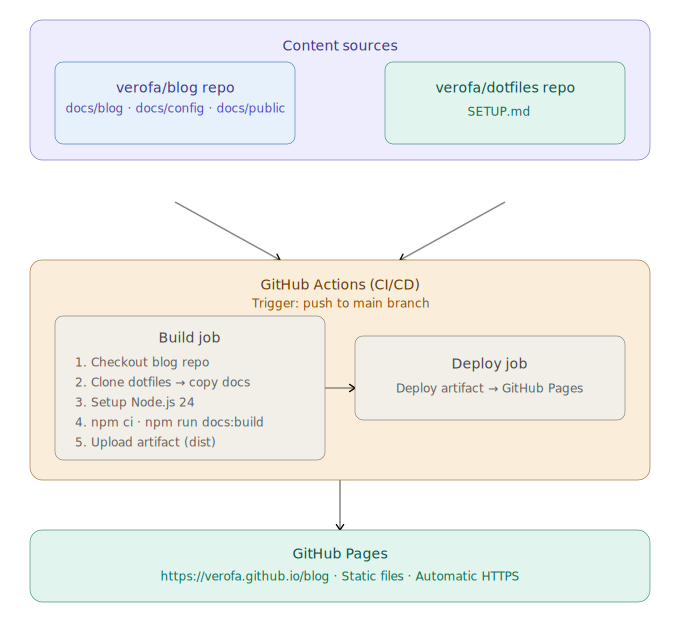

# 💜 The Purple Terminal

> _A purplish geeky blog for curious minds_

[](https://github.com/verofa/blog/actions/workflows/deploy.yml)
[](https://vitepress.dev)
[](https://verofa.github.io/blog)

A personal developer blog writing about DevOps, SRE, terminal tools, cloud
engineering and everything learned along the way, because sharing is caring, and I care 🦄

🌐 **Live at:** [verofa.github.io/blog](https://verofa.github.io/blog)

---

## 📋 Table of Contents

1. [About](#-about)
2. [Tech Stack](#-tech-stack)
3. [System Design](#-system-design)
4. [Project Structure](#-project-structure)
5. [Configuration](#-configuration)
6. [Deployment](#-deployment)
7. [Writing a New Post](#-writing-a-new-post)
8. [Local Development](#-local-development)
9. [Content Sources](#-content-sources)

---

## 🦄 About

The Purple Terminal is a personal developer blog focused on:

- 👻 **Terminal setup** > Ghostty, Fish shell, Starship, eza, Neovim, dotfiles
- ☁️ **Cloud tools** > AWS, GCP, Azure CLI workflows
- 🔧 **Troubleshooting** > real-world fixes for real-world problems
- 🚀 **DevOps & SRE** > tools, tips and best practices
- 📝 **Learning in public** > documenting the journey

---

## 🛠️ Tech Stack

| Technology                                                       | Purpose                              | Version |
| ---------------------------------------------------------------- | ------------------------------------ | ------- |
| [VitePress](https://vitepress.dev)                               | Static site generator                | 1.x     |
| [Vue.js](https://vuejs.org)                                      | Underlying framework (via VitePress) | 3.x     |
| [GitHub Pages](https://pages.github.com)                         | Hosting                              | -       |
| [GitHub Actions](https://github.com/features/actions)            | CI/CD deployment                     | -       |
| [Space Grotesk](https://fonts.google.com/specimen/Space+Grotesk) | Typography                           | -       |
| Markdown                                                         | Content format                       | -       |

---

## 🏗️ System Design

This blog follows a **docs-as-code** approach, content is written in Markdown, version controlled
in Git and automatically deployed via CI/CD.

<p align="center">

</p>

### How it works step by step

1. **Write** a new blog post in Markdown locally
2. **Push** to the `main` branch
3. **GitHub Actions** automatically triggers the build pipeline
4. The pipeline **clones the dotfiles repo** and copies `SETUP.md` into the blog
5. **VitePress builds** the static site from all Markdown files
6. The built files are **deployed to GitHub Pages**
7. The blog is **live** at `verofa.github.io/blog` within ~30 seconds

---

## 📁 Project Structure

```
blog/
├── .github/
│   └── workflows/
│       └── deploy.yml          ← GitHub Actions deployment pipeline
├── docs/
│   ├── .vitepress/
│   │   ├── config.mts          ← VitePress configuration
│   │   └── theme/
│   │       ├── index.ts        ← Theme entry point
│   │       └── custom.css      ← Custom styles and purple branding
│   ├── public/                 ← Static assets (images, icons)
│   │   ├── ghostty/            ← Ghostty post images
│   │   ├── neovim/             ← Neovim post images
│   │   └── fish/               ← Fish shell post images
│   ├── blog/                   ← Blog posts (Markdown)
│   │   ├── index.md            ← Blog index page
│   │   ├── ghostty-setup.md    ← Ghostty setup post
│   │   └── ...                 ← More posts
│   ├── config/                 ← Config showcase pages
│   │   ├── index.md
│   │   ├── ghostty.md
│   │   ├── fish.md
│   │   ├── starship.md
│   │   └── neovim.md
│   ├── index.md                ← Home page
│   ├── setup-guide.md          ← Auto-copied from dotfiles repo
│   └── dotfiles-readme.md      ← Auto-copied from dotfiles repo
├── .gitignore
├── package.json
└── README.md                   ← This file
```

---

## ⚙️ Configuration

### VitePress (`docs/.vitepress/config.mts`)

Key configuration:

```ts
export default defineConfig({
  title: "The Purple Terminal",
  base: '/blog/',               // GitHub Pages base path
  appearance: 'light',          // default theme
  ignoreDeadLinks: true,        // ignore dead links during build

  head: [
    // Space Grotesk font from Google Fonts
    ['link', { href: 'https://fonts.googleapis.com/css2?family=Space+Grotesk...', rel: 'stylesheet' }]
  ],

  themeConfig: {
    nav: [...],       // top navigation
    sidebar: {...},   // contextual sidebars
    search: { provider: 'local' },  // built-in search
    footer: {...},
  }
})
```

### Custom Theme (`docs/.vitepress/theme/custom.css`)

Key customisations:

- 💜 **Purple brand colors** > `#9D5FE0`, `#7B2FBE`, `#6B2FA0`
- 🔤 **Space Grotesk font** > overrides VitePress default font
- 🏠 **Hero layout** > full width single column instead of two columns
- 📰 **Purple headings** > `h1`, `h2`, `h3` in purple shades

---

## 🚀 Deployment

Deployment is fully automated via GitHub Actions on every push to `main`.

### Pipeline (`deploy.yml`)

```yaml
on:
  push:
    branches: [main]
  workflow_dispatch: # manual trigger available
```

### Actions used

| Action                          | Version | Purpose                |
| ------------------------------- | ------- | ---------------------- |
| `actions/checkout`              | v6      | Checkout blog repo     |
| `actions/setup-node`            | v6      | Setup Node.js 24       |
| `actions/upload-pages-artifact` | v4      | Upload built site      |
| `actions/deploy-pages`          | v4      | Deploy to GitHub Pages |

### External content

The pipeline automatically pulls content from the dotfiles repo:

```yaml
- name: Fetch docs from dotfiles repo
  run: |
    git clone https://github.com/verofa/dotfiles /tmp/dotfiles
    cp /tmp/dotfiles/SETUP.md docs/purple-terminal-setup.md
```

This means the Setup Guide page always reflects the **latest version** of the dotfiles documentation without any manual copying.

### Enable GitHub Pages, Build and Deployment

1. Go to **Settings** → **Pages**
2. Under **Source** select **GitHub Actions**
3. Push to `main` and the pipeline handles the rest

---

## 📝 Writing a New Post

1. Create a new Markdown file in `docs/blog/`:

```fish
nvim ~/blog/docs/blog/my-new-post.md
```

2. Add frontmatter at the top:

```markdown
# 🚀 My Post Title

_Published: March 2026 · 5 min read · Tags: `tag1` `tag2`_

---

Your content here...
```

3. Add it to the blog index (`docs/blog/index.md`):

```markdown
- [My Post Title](/blog/my-new-post) - _March 2026_
```

4. Add it to the sidebar in `config.mts`:

```ts
{ text: 'My Post Title', link: '/blog/my-new-post' }
```

5. Commit and push and it goes live automatically!

```fish
cd ~/blog
git add .
git commit -m "post: add my new post"
git push
```

---

## 💻 Local Development

```fish
# Clone the repo
gh repo clone verofa/blog ~/blog
cd ~/blog

# Install dependencies
npm install

# Start local dev server
npm run docs:dev
```

Open `http://localhost:5173/blog/` in your browser.

### Available commands

| Command                | Purpose                                |
| ---------------------- | -------------------------------------- |
| `npm run docs:dev`     | Start local dev server with hot reload |
| `npm run docs:build`   | Build static site for production       |
| `npm run docs:preview` | Preview production build locally       |

---

## 📚 Content Sources

| Page            | Source                     | Updated        |
| --------------- | -------------------------- | -------------- |
| Blog posts      | `docs/blog/*.md`           | Manually       |
| Setup Guide     | `verofa/dotfiles/SETUP.md` | Auto on deploy |
| Config showcase | `docs/config/*.md`         | Manually       |

---

_Built with 💜 and VitePress · Deployed on GitHub Pages_
